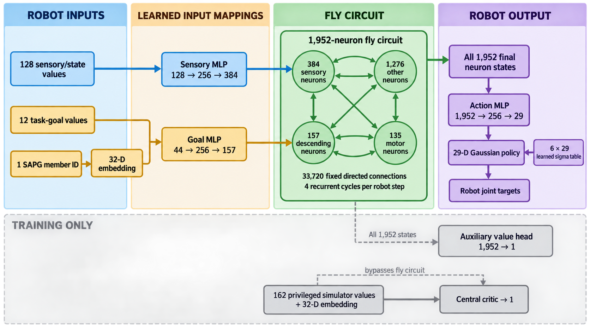

# Connectome Actor

The actor is a sparse rate RNN whose recurrent support and base weights come from MaleCNS.

Last updated: 2026-09-17

Related: [Overview](../overview.md), [Source](../sources/summaries/malecns-front-leg-circuit.md), [Workflow](../workflows/connectome-experiments.md), [Fixed reservoir](fixed-reservoir-controller.md), [Sparse backends](../analyses/sparse-backends.md)

## Plain-language overview of the current 1,952-cell circuit

The current compact graph is a selected wiring diagram around both fly front legs, not a whole fly brain or an already trained robot controller. Much of this leg circuitry sits in the ventral nerve cord, roughly analogous to a spinal cord. A neuron is represented here by one continuously varying activity number; a directed connection specifies how one neuron's previous activity affects another. These are simplified synchronous rate dynamics, not simulated spikes, muscles or detailed cellular chemistry. The [leg sensory circuit study](https://www.nature.com/articles/s41467-025-59302-3) provides biological context, not physiological identities for every cell in this MaleCNS selection.

Verified against `configs/connectome/malecns_1952.yaml`, `data/connectomes/processed/malecns_1952/{manifest.json,neurons.csv}` and `connectome_network_builder.py`:

| Interface group | Cells | Plain-language role |
| --- | ---: | --- |
| Selected front-leg proprioceptors | 92 | Body-sensing input: where a limb is and how it is moving or loaded; exact tuning is not known for every selected cell |
| Selected front-leg tactile cells | 292 | Touch-sensing input; retaining these neurons does not add tactile sensors to the robot observation |
| Selected descending input cells | 157 | Carry commands from higher brain areas toward movement circuits; our goal adapter drives these cells |
| Front-leg motor output cells | 135 | Normally send signals toward fly muscles; our readout converts their modeled activity into robot commands |
| Other retained cells outside those interfaces | 1,276 | Mostly local processing/connecting cells, but also additional ascending, descending and other cells; not all are local interneurons |

The sensory inventory contains 36 chordotonal-organ, 19 hair-plate, four campaniform and 33 less-specific leg annotations; these are not a complete physiological sensor census. The seed includes T1 families 13A (145), 13B (150), 09A (170) and 23B (145). T1 denotes the front-leg body segment, and family labels describe developmental groupings rather than a single computation performed by every member. Counts overlap other biological groups and must not be added to the interface table. Studies of subsets motivate motor coordination and sensory feedback hypotheses, not identical functions for all family members.

The original 140-value profiles send 128 robot body/object observations through a learned sensory adapter driving 384 cells. Goal information (12 numbers plus a 32-number conditioning code) enters another learned adapter driving 157 descending cells. The later structured 144-value profiles narrow the learned body route to selected proprioceptors and use Rotation-6D orientation. The [fixed-reservoir profile](fixed-reservoir-controller.md) goes further: parameter-free population codes drive selected proprioceptor and descending cells, SAPG conditioning moves to the output readout, and PPO never differentiates through the circuit. The default learned readout maps 135 motor activities to 29 robot commands; the explicit all-neuron-readout profile instead maps all 1,952 final recurrent states through the action MLP. There is no established one-to-one mapping from either fly front leg to particular robot fingers.

The selected graph contains 33,720 directed neuron-pair connections, each supported by at least five anatomical synaptic contacts. This is a graph-filter threshold, not a neural firing threshold or a learning hyperparameter. Selection preserved 1,285 seeds, added connecting paths to reach 1,596, then included all 356 additional direct sensory-to-intermediate-to-motor candidates. Those 356 were selected for their wiring, not to meet a round size quota. Forty-four retained cells have no edges in this filtered subgraph; isolated sensory cells, for example, cannot communicate with the rest through recurrence. Neither this graph nor the larger 4,778 reference establishes full biological circuit completeness.



*Current all-neuron learned-adapter dataflow. The privileged central critic is a
training-only path that bypasses the fly circuit.*

What is biological is the selected cell identity and source-derived wiring. What is engineered includes continuous activity dynamics, normalization, some transmitter-to-sign assumptions, observation adapters, action readout and training. Positive/negative modeled edges respectively increase/decrease the receiving cell's summed drive. Gains act as positive input/output volume controls on existing recurrent edges; they preserve edge directions and signs but can change behavior. The frozen-core profile keeps these controls fixed. Both profiles still need to learn the robot interface; native dexterity transfer remains a hypothesis.

## Observation normalization

The environment itself only partially normalizes the policy vector. Joint positions are mapped with the robot joint limits; quaternion or Rotation-6D entries are naturally bounded. Joint velocities, previous targets, palm position, relative fingertip/keypoint positions and object scales otherwise retain their task units, after which the complete actor and critic vectors are clamped to `[-10, 10]`.

The released SimToolReal PPO/LSTM profile then enables RL-Games per-coordinate running mean/variance normalization for both the actor observation and privileged critic state. It applies `(x - running_mean) / sqrt(running_var + 1e-5)` and clips the result to `[-5, 5]`. The SAPG coefficient ID is deliberately appended after this transform and is not treated as a continuous sensor. Statistics are stateful checkpoint buffers, updated without gradients during the first PPO mini-epoch and frozen for rollout/inference. The original LSTM also applies LayerNorm to the LSTM output before its post-recurrent MLP; that is internal activation normalization, not observation normalization.

| Policy family | Actor observation RMS | Fly-input transform | Privileged critic input RMS | Other enabled normalization |
| --- | --- | --- | --- | --- |
| Original SimToolReal LSTM/SAPG | Yes | None | Yes | LSTM-output LayerNorm, value and advantage normalization |
| Dense/MLP learned connectome adapters | Yes | Learned unbounded linear/MLP drive | Yes | Value and advantage normalization |
| Structured Rotation-6D adapters | Yes | Learned grouped linear sensory drive and unbounded descending MLP drive | Yes | Value and advantage normalization |
| Fixed-input cached reservoir | No, explicitly disabled | Fixed `tanh(x / scale)` population codes | Yes | Value and advantage normalization |

This table is verified in the actual resolved dense-connectome, structured Rotation-6D and fixed-reservoir run configurations. The stopped structured checkpoint contains a 144-coordinate actor running-stat state, while the fixed-reservoir checkpoint has no actor running-stat module. Both contain a 166-coordinate Rotation-6D privileged-state normalizer; the appended critic SAPG ID is excluded.

The learned-adapter policies are therefore not missing raw-observation normalization. Their remaining stability seam is the adapter-to-circuit drive: neither the grouped linear adapter nor the final layer of an interface MLP has output normalization or a bounding activation, so normalized robot inputs can still be amplified until recurrent preactivations saturate. A future adapter experiment should make bounded population drive, a fixed per-population gain, or an explicit drive-RMS/saturation penalty YAML-selectable and log sensory/descending drive statistics. Cross-cell batch or layer normalization is less attractive because it couples fly cells and removes absolute population-drive magnitude.

For the cached reservoir, enabling the existing online running normalizer is specifically undesirable. PPO minibatches reuse already-cached motor features, so running statistics could change without recomputing the fly response; the following rollout would then use a different robot-to-fly transform that the readout update never saw. Prefer a fixed, precomputed or physically specified per-channel calibration, stored in YAML/artifact provenance and frozen before training. Zero-meaning channels such as velocity and goal error should retain zero center; absolute palm position and object dimensions can use a fixed workspace/reference center; scale should be per channel or per physical family. Changing that transform is a fresh policy architecture and must not be introduced into a running checkpoint.

## Contract

System observations enter sensory neurons, goal and SAPG exploration conditioning enter descending neurons, and the default action readout decodes motor-neuron state into 29 robot actions. The explicit all-neuron profile is the exception: its action MLP reads every final recurrent state. The interface projections can use the backward-compatible linear layers or an optional one-hidden-layer MLP. The default remains linear and learns adapters and heads only. Optional weight adaptation and learned leaks/biases are independent; see [adaptation controls](connectome-adaptation.md). The dynamics and parameter accounting below describe the preserved gains-plus-dynamics control.

For PPO, the privileged asymmetric critic remains the standard SimToolReal MLP and never consumes connectome state. The separate eligibility trainer instead uses a critic on observations plus detached recurrent activity; see [eligibility training](../workflows/eligibility-training.md).

The [2026-09-15 audit](../analyses/system-audit-2026-09-15.md) clarifies that PPO also defaults to an **auxiliary actor-side value loss**: `use_experimental_cv: true` trains the actor's own value head even though the separate central critic supplies rollout values. Learned-adapter profiles feed that head all recurrent cells; cached fixed-reservoir profiles feed it the selected cached readout vector. This is distinct from the privileged critic architecture. The existing false override disables that auxiliary objective, not the central critic.

The misleading flag name is inherited from upstream `rl_games`, not introduced for SAPG or the connectome. Upstream first added `use_old_cv` on 2021-01-08 to restore the old behavior of training the policy network's value head even when a separate central-value network exists. Commit [`a3cd66f`](https://github.com/Denys88/rl_games/commit/a3cd66f81b57b9c87eb8e6a3a8c14517e198708a) renamed it to `use_experimental_cv` the next day while adding the path to discrete A2C; commit [`32ae387`](https://github.com/Denys88/rl_games/commit/32ae3873be22d6b0dfd30c8b7372d6d9886dbd2e) retained the continuous default of `true` during an asymmetric-critic fix. SimToolReal imported that upstream behavior in its initial 2026 release. There is no connectome-specific algorithm behind the word `experimental`: in current continuous PPO it is only a gate on the policy model's additional value loss.

The SimToolReal paper supports the separate privileged critic but does not disclose this auxiliary actor-value path. Its five-seed Figure 8 ablation replaces the privileged critic with a symmetric critic that sees the actor's partial observations; it does not compare `use_experimental_cv` values. Thus `false` retains the paper-backed asymmetry, while `true` remains necessary for exact released-code reproduction. See [training references](../sources/summaries/simtoolreal-training-references.md).

With `use_experimental_cv: false` and the standard asymmetric `central_value_config` still present, the critic input is unchanged. SimToolReal constructs 162 clean privileged state values before applying policy observation delay/noise: the 140 policy fields plus palm linear/angular velocity (6), object linear/angular velocity (6), closest furthest-keypoint distance (1), five closest fingertip distances, lifted-object flag (1), log progress (1), log successes (1), and the reward buffer scaled by `0.01` (1). SAPG appends one scalar exploration-member identifier at the rollout interface; the central-value network replaces that identifier with its learned 32-value embedding, so its MLP consumes 194 values. It does not consume connectome hidden state or actions. The false flag makes the actor-side critic loss zero while rollout values, bootstrapping, advantages and central-critic fitting continue to use this privileged critic.

### Auxiliary value loss: connectome versus LSTM

With a central critic configured, rollout collection overwrites the actor model's value prediction with the privileged critic prediction. GAE, returns, and PPO advantages therefore use the privileged critic for both actor architectures. During actor optimization, `use_experimental_cv: true` separately enables the actor model's own clipped squared value loss against those returns. With the current `critic_coef: 4`, its contribution to the actor optimizer objective is `0.5 * 4 * c_loss = 2 * c_loss`. Because the stored old-value tensor also came from the privileged critic, value clipping is anchored to the old privileged-critic prediction rather than to a prior prediction from the actor-side value head.

The standard LSTM profile uses `separate: false`: its auxiliary scalar value head and action-mean head both read the same post-LSTM, post-MLP 512-value feature vector. Its learned actor-side `6 x 32` SAPG embedding is concatenated with the policy observation before the LSTM. The auxiliary loss therefore updates that embedding, the value head, shared `LSTM[1024]`, and shared `MLP[1024,1024,512,512]`, but not the distinct action-mean or coefficient-conditioned sigma head through the value branch itself.

For learned-adapter connectome profiles, the auxiliary value head is a dense linear map from every recurrent cell. The default action mean reads only the motor-cell subset, so its 135-feature action path and 1,952-feature auxiliary value path differ. The explicit all-neuron action profile makes both heads consume the same 1,952 final recurrent states, although the value head remains linear and the action head has its own MLP. In cached fixed-reservoir profiles, both heads instead consume the same selected cached readout vector (normally 135 motor features plus the actor-side SAPG embedding). For learned adapters, the value gradient updates the dense value head and every trainable upstream component that affects recurrent state: sensory/descending adapters, plus gains, recurrent modulation, leak, or bias when enabled. It does not directly update the action readout or sigma parameters through the value branch. The auxiliary signal can encourage return-predictive circuit states, but it can also optimize them for value prediction rather than action production; no paper ablation establishes its net effect.

The authoritative privileged central critic is different from this auxiliary head. It consumes clean simulator state and its own SAPG embedding, not fly recurrent state. This is a valid action-independent PPO baseline and preserves asymmetric training. For a recurrent policy, however, the exact policy-conditioned value is generally a function of both environment state and actor memory because two identical physical states can induce different future actions from different recurrent states. A future critic-input ablation should therefore compare privileged state alone against privileged state plus detached actor recurrent features. Detaching the fly features would keep central-critic gradients out of the actor. This is a value-estimation hypothesis, not evidence that the current critic is wrong or that all 1,952 features are the best compression.

There are therefore two different SimToolReal analogues. The paper-level analogue keeps only the privileged central critic and does not require fly features or the undocumented actor-side value loss. The exact released-code analogue also keeps the central critic privileged-only, but retains the auxiliary actor value head. In the LSTM implementation, that auxiliary value head and the action-mean head branch from the same post-LSTM/post-MLP feature vector. An exact connectome analogue would likewise branch action and auxiliary value heads from one shared post-connectome readout trunk. The current motor-readout connectome is not exact because action uses 135 motor states while auxiliary value uses all 1,952 states; the all-neuron profile gives both heads the same raw recurrent vector but still uses separate action-MLP and direct-linear value transformations.

Both architectures therefore train their actor-side SAPG embedding through the actor objective, with the auxiliary value objective adding another gradient path when enabled. Separately, each privileged critic owns another `6 x 32` SAPG embedding selected from the state-side coefficient identifier; that table is trained only with the central-critic loss. The actor and critic embeddings are not shared.

The same audit verifies that disjoint input/motor ports and one synchronous update impose an exact current-observation-to-current-action-mean delay. It finds severe sensory/descending preactivation saturation in both tanh-policy checkpoints. Frozen weights therefore do not imply a preserved functional operating regime. Source-derived adjacency, signed scalar tanh dynamics and the upstream physiological rate model must also be distinguished; the current actor does not reproduce the upstream executable simulation merely by importing its graph.

The audit's [timing proposal](../analyses/system-audit-2026-09-15.md#neural-timing-and-body-interface) tests four/eight internal updates with one held observation per control decision, matching substep leak to the original passive decay. This is not a sequence-length increase or an implemented runtime option. It also distinguishes output-action squashing from internal-neuron saturation: consistent bounded-action entropy addresses the former distribution objective, while calibrated input drives and functional sensitivity checks address the latter operating regime.

## Interface projection architectures

`params.network.connectome.interface_projections.architecture` selects one shared architecture for the sensory input projection, goal-plus-conditioning projection, and motor-state action-mean projection:

- `linear` preserves the original single-layer interface and checkpoint parameter names. It is the default, including when an older configuration omits `interface_projections`.
- `mlp` uses `Linear -> ELU -> Linear`. `hidden_size` is the backward-compatible shared hidden width. Optional `sensory_hidden_size`, `descending_hidden_size`, and `readout_hidden_size` values independently override it for the robot-sensory, goal/SAPG-to-descending, and fly-state-to-action paths. `activation` remains shared. Existing profiles therefore retain three 256-unit hidden layers unless they opt into the independent fields.

The input projections retain `population_adapters.bias: false`, so both linear layers in each input MLP are bias-free. Both layers in the action MLP have biases. Every hidden/input layer uses Xavier initialization; the final action layer retains the small `[-1e-3, 1e-3]` initialization used by the linear readout. The actor-side value head remains linear because it is a training head, not part of the deployed observation-to-action interface.

For the 1,952-cell graph, the MLP shapes are:

| Projection | MLP shapes |
| --- | --- |
| robot sensory features to sensory cells | `128 -> 256 -> 384` |
| goal plus SAPG conditioning to descending cells | `44 -> 256 -> 157` |
| motor-cell state to robot action mean | `135 -> 256 -> 29` |

This changes the adapters-only actor from 62,323 to 227,116 trainable scalars, and the neuron-gains actor from 66,227 to 231,020. The increase is 164,793 trainable scalars in either case. It makes the cross-species interface substantially more expressive, so attribution to the fixed fly-derived recurrent computation becomes weaker unless linear and MLP interfaces are evaluated as matched controls.

### Attribution with MLP interfaces and no gain adaptation

The compact `SimToolRealConnectome1952AdaptersMLPSAPG` profile inherits `weight_mode: adapters_only` and `learn_dynamics: false`: recurrent weights, gains, leak and bias remain fixed. Its three interface MLPs contain 224,797 learned parameters (131,072 sensory, 51,456 descending, 42,269 action readout); the actor total additionally includes its value head, conditioning embeddings and exploration parameters. This count measures learned capacity, not percentage of causal computation.

Source inspection of `_step` and `forward` in `connectome_network_builder.py` confirms no direct robot-observation shortcut to the action-mean MLP: that MLP receives only the 135 motor-cell activities. The input MLPs can nevertheless compute sophisticated features or control-relevant codes, and the output MLP can decode them nonlinearly. A fixed recurrent network can act as a useful transformation/memory channel without its particular biological wiring being uniquely useful. Furthermore, learned inputs can change which dynamical regimes the fixed circuit visits. Therefore necessary routing through the circuit does not establish that native fly motor computations supply the task strategy.

Defensible without further evaluation: the policy uses a fixed fly-derived recurrent circuit with learned nonlinear input/output interfaces. Not established: a percentage of intelligence supplied by the circuit, native dexterity transfer, or an advantage of biological wiring. Test biological specificity by independently retraining matched MLP interfaces around degree-preserving rewired and random frozen graphs, matching populations, edge/sign/scale statistics, optimization and evaluation. Compare against a directly trained MLP controller with a stated capacity and observation/history budget as well. Perturbing circuit state or wiring only at inference tests dependence of an already trained policy, but its distribution shift does not show that a matched replacement could not learn. These are proposed controls, not completed attribution results.

## Dynamics

For each environment step the actor applies

\[
h_{t+1}=(1-\alpha)\odot h_t+\alpha\odot\tanh\left(0.9e^p\odot\left[W(e^q\odot h_t)\right]+B_sx_t^{sens}+B_gx_t^{goal}+b\right).
\]

`W` is the fixed destination-by-source CSR operator normalized to spectral radius one. Incoming and outgoing gains use a bounded log-space parameterization in `[0.25, 4]` and initialize at one. Leak is sigmoid-parameterized and initializes at `0.5`; recurrent bias initializes at zero. Sparse recurrence is always FP32, including under mixed-precision PPO.

### Interpreting neuron gains

For an edge from source neuron `j` to destination neuron `i`, the recurrent edge multiplier is `g_out[j] * g_in[i]`. The outgoing gain therefore controls how strongly a source neuron's current hidden state is broadcast along all of its recurrent outputs. The incoming gain controls how strongly a destination responds to the sum of recurrent signals arriving at it. Neither is a complete scalar measure of neuron importance.

A low outgoing gain attenuates recurrent influence but does not turn the neuron off. Current gains cannot reach zero: each lies in `[0.25, 4]`, so one gain attenuates by at most fourfold and a low-low edge by at most sixteenfold. Direct sensory/descending drive and recurrent bias are added after incoming-gain scaling; hidden state also persists through the leak term. Motor-neuron state feeds the learned action readout directly without outgoing-gain multiplication, and every neuron feeds the actor value head directly. Consequently, even a hypothetical zero outgoing gain would silence recurrent transmission from a node but would not necessarily remove its direct action/value contribution. A causal node-importance claim requires an explicit hidden-state/readout ablation and closed-loop evaluation, not inspection of learned gain magnitude alone.

## Trainable parameters

### Current live all-neuron MLP actors

Both live 1,952-cell all-neuron Gaussian jobs use the same actor declaration:
**692,268** `requires_grad=True` policy scalars. This is **8.86%** of the
unchanged original SimToolReal LSTM/SAPG actor's **7,811,468** scalars, or about
**11.28x fewer**. The count is verified from the live GPU-1 recovery checkpoint
parameter shapes, not inferred from checkpoint file size:

| Group | Count |
| --- | ---: |
| SAPG embedding and six log-standard-deviation rows | 366 |
| Bias-free sensory MLP, `128 -> 256 -> 384` | 131,072 |
| Bias-free descending MLP, `44 -> 256 -> 157` | 51,456 |
| All-neuron action MLP, `1,952 -> 256 -> 29` | 507,421 |
| Auxiliary actor value head, `1,952 -> 1` | 1,953 |
| **Actor total** | **692,268** |

The GPU-0 `use_experimental_cv: false` job still declares the 1,953-scalar
auxiliary value head as a parameter, but its loss is disabled, so only
**690,315** actor scalars receive an optimization gradient. The GPU-1 true job
optimizes all 692,268. Neither count includes the frozen `33,720` edge values,
CSR indices, masks, or the four frozen 1,952-cell dynamics vectors. The
asymmetric critic is separate and unchanged at 2,037,769 scalars: total
optimization capacity is 2,730,037 for the true job and 2,728,084 actively
updated scalars for the false job. The equivalent original LSTM-plus-critic
training system has 9,849,237 scalars.

The original LSTM actor count is exact for its SAPG configuration: a 172-input
single-layer 1,024-unit LSTM (140 observations plus a learned 32-value SAPG
embedding), LayerNorm, `1024 -> 1024 -> 1024 -> 512 -> 512` MLP, action/value
heads, six log-standard-deviation rows, and the six SAPG embeddings. The
original actor has no fly circuit.

### MLP-width lower bounds

The live learned-adapter profile uses one shared
`interface_projections.hidden_size: 256` for all three MLPs. It is asymmetric
in its outer dimensions (`128 -> 384`, `44 -> 157`, and `1,952 -> 29`), but its
three hidden widths are not asymmetric. Independent hidden widths are now
selectable through `sensory_hidden_size`, `descending_hidden_size`, and
`readout_hidden_size`, each of which falls back to the shared `hidden_size` when
omitted. The hard
dimensional limits are different by interface:

| Hidden width | Sensory `128 -> H -> 384` | Descending `44 -> H -> 157` | All-neuron action `1,952 -> H -> 29` | Actor scalars |
| ---: | --- | --- | --- | ---: |
| 256 (live) | no input-rank bottleneck | no input-rank bottleneck | ample decoder capacity | 692,268 |
| 128 | no input-rank bottleneck | no input-rank bottleneck | 128 learned decoder features for 29 actions | 347,308 |
| 96 | compresses the raw 128-D sensory vector | no input-rank bottleneck | 96 decoder features | 261,068 |
| 64 | compresses sensory input | no input-rank bottleneck | 64 decoder features | 174,828 |

Thus **128 is the smallest shared YAML width that does not force a rank
bottleneck at either learned input adapter**. It nearly halves the actor count
and is the appropriate first matched ablation. The action path necessarily ends
in 29 command values, so `H < 1,952` is not an information bottleneck in the
same strict sense; a width of at least 29 can still represent an arbitrary
*linear* 1,952-to-29 map. Smaller action widths nevertheless reduce nonlinear
decoder capacity and should be treated as an empirical capacity choice, not as
free compression.

One asymmetric design would keep sensory at 128, use 64 for the 44-D descending
route, and use 64 or 128 for the action decoder. It would have 207,596 or
334,444 actor scalars respectively. Those widths are now selectable in YAML,
although no learning result establishes that either action width is sufficient.
They should be compared at the same seed, optimizer, critic, and frame budget.

An even smaller proposed nonlinear profile, sensory/descending/action widths
`128/64/32`, has **144,172** declared actor scalars: 65,536 sensory, 12,864
descending, 63,453 action, 1,953 auxiliary value-head, and 366 SAPG
embedding/log-standard-deviation parameters. The no-auxiliary run would
actively update 142,219 of them. This is 4.80x smaller than the live 692,268
actor, although adding the unchanged 2,037,769-scalar central critic gives a
2,181,941-scalar training system.

The implemented
`SimToolRealConnectome1952AdaptersMLP128x32x32AllNeuronReadoutGaussianSigma3SAPG`
profile is more aggressive on the descending route: `128/32/32`. Its three
interfaces contain 65,536, 6,432, and 63,453 parameters. Including the
1,953-scalar auxiliary actor value head and 366 SAPG embedding/exploration
parameters gives **137,740 declared actor scalars**, 19.9% of the live
692,268-scalar actor. With `use_experimental_cv: false`, the value head remains
declared but does not receive gradients, leaving 135,787 actively updated actor
scalars. These are capacity counts, not evidence that the smaller policy
retains task performance.

If every coordinate is treated as independent, the smallest hidden widths that
avoid forced rank loss are `128/44/29`, yielding **134,206** actor scalars. The
goal path can plausibly be narrower because its 32 embedding coordinates are
selected from only six learned SAPG rows: the combined 12 continuous goals plus
six-row embedding span is at most 18-dimensional. A `128/18/29` design would
have **128,980** actor scalars, but that uses this structure rather than
preserving all 44 nominal coordinates independently. Width below 29 on the
action path constrains the local 29-output action Jacobian to rank below 29 and
therefore assumes motor synergies rather than merely removing redundancy.

The existing direct-linear interface is smaller still: `128 -> 384`,
`44 -> 157`, and `1,952 -> 29` require **115,016** total actor scalars while
retaining the maximum possible linear ranks 128, 44, and 29. It removes the
hidden nonlinear feature transformation, so this is an expressivity tradeoff,
not a stricter information-rank bottleneck.

The gains-plus-dynamics SAPG control (previous primary actor) has 109,796 trainable scalars in 12 parameter tensors:

| Group | Shape | Count |
| --- | --- | ---: |
| sensory adapter | `232 x 128` | 29,696 |
| descending adapter | `1236 x 44` | 54,384 |
| incoming neuron gains | `4310` | 4,310 |
| outgoing neuron gains | `4310` | 4,310 |
| neuron leaks | `4310` | 4,310 |
| recurrent biases | `4310` | 4,310 |
| motor action readout weight and bias | `29 x 130`, `29` | 3,799 |
| actor value-head weight and bias | `1 x 4310`, `1` | 4,311 |
| six SAPG embeddings | `6 x 32` | 192 |
| six coefficient-conditioned log standard deviations | `6 x 29` | 174 |
| **Total** | | **109,796** |

The 118,920 biological weights, CSR row/column indices, and population masks are fixed checkpoint buffers, not optimizer parameters. In the frozen-core ablation the gain, leak, and recurrent-bias vectors are also frozen, leaving 92,556 trainable actor scalars. Biological, rewired, and random neuron-gain actors have the same parameter count.

The unchanged asymmetric central critic is separate. It has 2,037,769 trainable scalars: a 194-dimensional input (162 privileged state values plus a 32-dimensional SAPG embedding), the `1024, 1024, 512, 512` MLP, its scalar value output, and six learned SAPG embeddings. The actor-side value head is still optimized because this repository defaults `use_experimental_cv` to true while also training the central critic.

## Adaptation versus LoRA

The neuron-gain plasticity is not standard LoRA. LoRA applies an additive low-rank update, usually written

\[
W_{effective}=W+BA.
\]

Such an update can change an individual connection's sign and, unless explicitly masked, create effective connections wherever the base matrix is zero. The connectome actor instead uses

\[
W_{effective}=\operatorname{diag}(g_{in})W\operatorname{diag}(g_{out}),
\]

so an existing edge from source neuron `j` to destination neuron `i` is multiplied by the positive factor `g_in[i] * g_out[j]`. This is closer to a multiplicative diagonal adapter such as IA3 than to LoRA. It preserves the exact zero/nonzero graph, every edge direction, and every transmitter-derived sign; it cannot introduce a new edge. It also forces all outputs of one source and all inputs of one destination to share gain factors instead of learning 118,920 independent synaptic changes.

These structural safeguards do not prove functional preservation. Each gain is bounded to `[0.25, 4]`, but their product permits an existing edge to range from `0.0625` to `16` times its base magnitude. Learned leaks can approach zero or one, recurrent biases and dense input adapters are not bounded, and strong drives can saturate `tanh`. The fixed base operator has spectral radius one, while the gained effective operator need not. The extracted connectome is measured anatomy and signed synaptic strength, not a pretrained executable controller for the robot, so there is no established robot-control policy whose behavior can be guaranteed unchanged.

## Attribution boundary

The defensible claim is that this is an **RL-trained policy with a MaleCNS-derived recurrent scaffold**, not that its performance comes from an original fly brain. The 4,310-cell graph is a VNC-restricted front-leg extraction, not the complete approximately 166,000-cell MaleCNS. The 1,952-cell graph is an additional algorithmically selected path-plus-motif subset. Neither graph is a pretrained fly controller for this robot task.

The current gains actors preserve these source-derived quantities exactly in storage:

- neuron identities retained by the selected graph and the sensory, descending, and motor population masks;
- directed zero/nonzero edge support;
- the transmitter-derived sign assigned to every retained edge;
- the globally spectral-normalized base magnitude of every retained edge.

They do not execute those base magnitudes unchanged. Runtime recurrence is `diag(g_in) W diag(g_out)`, so every edge magnitude is altered by two learned positive cell-wide factors. This preserves support, direction, and sign and is much more constrained than edgewise fine-tuning, but it can substantially change pathway balance, recurrent spectrum, saturation, and closed-loop computation. The fixed leak of 0.5, zero recurrent bias, `tanh`, synchronous discrete updates, and recurrent scale 0.9 are engineering choices rather than measured MaleCNS physiology.

The cross-species interfaces are wholly learned. Robot features are densely mixed into selected biological populations; the 32-dimensional SAPG coefficient embedding is injected with goal features into descending cells; and a learned dense matrix maps motor-cell activity to 29 robot commands. There is no fly sensor-to-robot sensor or fly muscle-to-robot joint homology. The privileged 2,037,769-parameter asymmetric critic is also non-biological: it shapes learning but is absent from the deployed action path.

| Graph | Fixed base edges | Trainable actor | Learned input adapters | Learned gains | Learned action-mean head |
| --- | ---: | ---: | ---: | ---: | ---: |
| 4,310-cell | 118,920 | 101,176 | 84,080 (83.1%) | 8,620 (8.5%) | 3,799 (3.8%) |
| 1,952-cell | 33,720 | 66,227 | 56,060 (84.6%) | 3,904 (5.9%) | 3,944 (6.0%) |

The remaining trainable actor parameters are the actor-value head, SAPG embeddings, and action log standard deviations. Parameter percentages do not measure causal importance, but they show that most learned degrees of freedom are in the synthetic robot-to-connectome interface, not biological weights.

An audit of stable inference milestones compared the stored effective operator with the prepared artifact:

| Graph checkpoint | Base buffer exactly matches artifact | Median edge multiplier | Edges within +/-10% of base | Edges within +/-25% | Relative weighted-matrix L2 change | Base/effective spectral radius |
| --- | --- | ---: | ---: | ---: | ---: | ---: |
| 4,310 at 750,059,520 frames | yes | 0.649x | 10.5% | 27.5% | 0.697 | 1.000 / 1.119 |
| 1,952 at 250,085,376 frames | yes | 0.944x | 20.0% | 48.6% | 0.604 | 1.000 / 0.814 |

For the 4,310 graph, 66.9% of edges remain within a factor of two of base and the observed range is 0.074x--15.987x. For the 1,952 graph, 90.7% remain within a factor of two and the observed range is 0.233x--10.652x. The relative change is `||W_effective - W_base||_2 / ||W_base||_2` over the edge-value arrays, so stronger base edges contribute more. These measurements show that the anatomical buffers remain exact while the operator actually used by the policy has already changed materially.

A biological-topology attribution requires matched adapters-only, degree-preserving rewired, and random sparse controls with the same interfaces, optimizer schedule, seeds, and evaluations. If the biological graph consistently beats those controls, the result supports a contribution from its weighted signed recurrent organization. The adapters-only profile makes the stronger preservation test because its effective recurrent matrix stays exactly fixed; the gains profile tests a broader hypothesis that biological organization is a useful constrained starting scaffold.

The frozen-core profile is the strict structural-dynamics control: recurrent weights, gains, leaks, and recurrent bias all remain at their initialized values while the cross-species input adapters and robot action/value heads learn. For a conservative trainable-core experiment, narrow the gain interval, bound leak and bias deviations, penalize log gains and deviations from initial leak/bias, warm up adapters and readouts with the recurrent core frozen, and monitor effective spectral radius and activation saturation before gradually unfreezing the core. A topology-preserving LoRA-like extension would apply a masked multiplicative modulation such as `W * exp(U V^T)` only on existing edges and regularize it toward identity; an unmasked additive `W + BA` would violate the biological support and sign invariants.

Policy observations `0:125` and `137:140` form the 128-dimensional sensory input. Observations `125:137` form the 12-dimensional goal input. SAPG's learned 32-dimensional coefficient embedding is concatenated with the goal before the descending-neuron adapter. The 130 motor-neuron states alone feed the 29-dimensional action-mean head. Action log standard deviations remain coefficient-conditioned.

## Robot-to-connectome interface

The connectome is a recurrent wiring prior, not a literal fly sensor-to-muscle controller. Learned dense adapters establish the cross-species interface; PPO trains these adapters and the robot readout from task reward.

The environment concatenates its 140 policy observations in this order:

| Indices | Size | Quantity | Connectome route |
| --- | ---: | --- | --- |
| `0:29` | 29 | normalized arm and hand joint positions | sensory adapter |
| `29:58` | 29 | arm and hand joint velocities | sensory adapter |
| `58:87` | 29 | previous joint-position targets | sensory adapter |
| `87:90` | 3 | palm position | sensory adapter |
| `90:94` | 4 | palm quaternion | sensory adapter |
| `94:98` | 4 | object quaternion | sensory adapter |
| `98:113` | 15 | five fingertip positions relative to the palm | sensory adapter |
| `113:125` | 12 | four object keypoints relative to the palm | sensory adapter |
| `125:137` | 12 | four object keypoints relative to the goal | descending adapter |
| `137:140` | 3 | object scale | sensory adapter |

Thus the learned sensory matrix has shape `232 x 128`. It mixes the 128 selected robot features into drives for the 232 biological sensory neurons. The learned descending matrix has shape `1236 x 44`: 12 goal-error features plus SAPG's 32-dimensional exploration embedding drive the 1,236 descending neurons. There is no claimed one-to-one homology between a robot joint and a fly neuron.

After one recurrent update, the runtime gathers only the 130 biological motor-neuron states. A learned `29 x 130` linear readout produces the Gaussian policy mean for seven arm commands and 22 hand commands. The coefficient-conditioned log standard deviation supplies exploration during training; the sampled action is clipped to `[-1, 1]` before entering the environment.

The 29 policy outputs are normalized commands rather than joint angles. With the preserved default controller, the first seven are velocity-like increments from the previous arm target:

\[
\hat q^{arm}_{t+1}=\operatorname{clip}\left(q^{target}_t+1.5\,\Delta t\,a^{arm}_t, q_{min}, q_{max}\right),
\]

followed by the configured moving average. The final 22 commands are mapped linearly from `[-1, 1]` to each hand joint's physical limits and then smoothed and clamped. Isaac Gym receives the resulting 29-vector as its DOF position target. Observation and action delay queues remain those of the original SimToolReal environment.

## Structured sensory adapter with 6D orientation

The structured interface is implemented as separate YAML-selected profiles, not a replacement for the dense adapter and not a claim of joint-to-fly-neuron homology. The compact artifact now persists a verified partition of its 384-cell sensory port into 92 proprioceptor-labelled and 292 tactile-labelled cells. It does not provide verified claw/hook/club tuning for every proprioceptor, nor a mapping from a fly front leg to a robot finger.

The structured task converts the absolute palm and object `xyzw` quaternions to the first two rotation-matrix columns before rl_games normalization. Its 144 policy observations route as follows:

| Input channel | Observation fields | Size | Direct target |
| --- | --- | ---: | --- |
| Body/efference | joint position, joint velocity, previous action targets, fingertip positions relative to palm | 102 | 92 proprioceptor-labelled cells |
| Object/context | palm position/6D rotation, object 6D rotation, object keypoints relative to palm, object scale | 30 | 157 descending cells |
| Goal | object keypoints relative to goal | 12 | 157 descending cells |
| SAPG identity | learned exploration-member embedding | 32 | 157 descending cells |
| Touch | none in the current actor observation | 0 | no direct drive to the 292 tactile-labelled cells |

This preserves every existing physical observation while replacing two four-value orientation encodings with two six-value encodings and changing where signals enter the circuit. Tactile cells remain recurrently active; they are not removed or clamped. Giving them zero direct input is preferable to relabelling kinematics or object pose as touch. Adding force/contact channels is a separate policy-observation and real-deployment contract and should be evaluated separately.

### Initial parameterization

Six learned linear modules map the 102 body/efference features to the 92 proprioceptor cells. Their YAML-owned groups are arm, thumb, index, middle, ring and pinky, following the asset order of seven arm plus 22 hand DOFs. The corresponding position, velocity and previous-target features for a group may drive only that group's allocated proprioceptor block; the five three-coordinate fingertip vectors drive their corresponding finger blocks. The implementation allocates the 92 cells deterministically by sorted body ID, approximately in proportion to each robot group's feature count. This is a stable engineering assignment, not inferred anatomy.

Start with learned weights inside the mask rather than fixed hand-designed tuning. A later profile can replace or augment those weights with fixed opponent codes for normalized position, signed velocity and target error, plus per-cell gains and a tightly constrained masked residual. This separates the value of population structure from the value of a particular hand-designed code.

Object/context, goal and the SAPG embedding form a 74-value descending input. A `74 -> 128 -> 157` ELU MLP maps that vector to the descending cells. Routing object context here treats it as task/context information rather than fabricated peripheral sensation. Because this is an engineering interpretation, include an ablation that retains the old dense sensory routing rather than presenting it as biology.

Use separate architecture choices for the two input routes. The body-to-proprioceptor projection should initially be masked linear: this keeps the declared robot-group structure exact and prevents a shared hidden layer from reconstructing arbitrary cross-group mixing before the connectome. The context/goal-to-descending projection may use a small MLP because pose relations are nonlinear and descending cells are already an engineered task/context interface. Keep the action readout architecture unchanged for the first routing comparison. The current single `interface_projections.architecture` option applies one architecture to all interfaces, so the structured profile needs per-route architecture keys rather than changing existing profile semantics.

The conversion is applied in `SimToolReal` before actor and central-critic observations are concatenated, delayed observations are normalized, or the connectome sees them. It concatenates rotation-matrix column one followed by column two, making `q` and `-q` identical. The new task has 144 actor observations and 166 privileged state values; with the 32-value critic-side SAPG embedding, the central critic consumes 198 values. These profiles require fresh checkpoints and normalization state. The released 140-value task and all existing profiles remain unchanged.

The implemented train-profile contract is:

```yaml
params:
  network:
    connectome:
      structured_input_adapter:
        mode: grouped_linear
        groups:
          - {name: arm, dof_range: [0, 7], fingertip_index: null}
          - {name: thumb, dof_range: [7, 12], fingertip_index: 3}
          - {name: index, dof_range: [12, 16], fingertip_index: 0}
          - {name: middle, dof_range: [16, 20], fingertip_index: 1}
          - {name: ring, dof_range: [20, 24], fingertip_index: 2}
          - {name: pinky, dof_range: [24, 29], fingertip_index: 4}
        descending_projection:
          architecture: mlp
          hidden_size: 128
      observations:
        policy_size: 144
        sensory_ranges: [[0, 87], [102, 117]]
        context_ranges: [[87, 102], [117, 129], [141, 144]]
        goal_ranges: [[129, 141]]
```

The exact group feature indices and proprioceptor positions are persistent checkpoint buffers, so a resume cannot silently substitute another assignment. The existing `observations.sensory_ranges`/`goal_ranges` contract remains the default for old profiles and checkpoints.

### Implementation contract

1. Compact graph preparation persists `front_proprioceptors_indices` and `front_tactile_indices`, validates the graph before an atomic backward-compatible artifact upgrade, and the actor verifies that the arrays are disjoint and exactly partition `sensory_indices`.
2. Six independent bias-free linear modules cover arm, thumb, index, middle, ring and pinky inputs. The 92 proprioceptor cells are allocated proportionally by feature count as `[19, 16, 14, 14, 13, 16]` in sorted-body-ID order. Their outputs are scattered into the full 384-value sensory drive; tactile positions are exact zeros.
3. The structured actor validates that sensory, context and goal ranges form a disjoint exact partition of `0:144`. Existing dense profile parameter names, observation dimensions and checkpoint loading remain unchanged.
4. The existing fused and non-fused recurrent kernels are unchanged because they still receive a 384-value sensory drive and 157-value descending drive.
5. `connectome_eligibility` explicitly rejects the structured adapter. Its trace implementation assumes a standard dense `sensory_adapter.weight`; supporting grouped modules requires new trace equations and checkpoint-state tests. PPO/SAPG uses ordinary autograd and is supported.

### Evaluation contract

The two supplied suites match the currently running capped-Gaussian and restricted-Beta LF contracts respectively, including graph, PPO/SAPG settings, entropy scale, `use_experimental_cv`, four neural updates, seed and frame budget. They intentionally change both routing and rotation representation. A later causal matrix should independently test the current dense interface, grouped learned interface, quaternion-versus-6D encoding, and grouped interface with a fixed shuffled cell allocation. The shuffle control preserves sparsity and parameter count while testing whether the chosen population assignment matters.

Record per-population direct-drive RMS, recurrent preactivation RMS and saturation, hidden-state RMS, adapter gradient norms, and current-observation-to-motor sensitivity. Assert that tactile direct drive and cross-group masked weights remain exactly zero. Primary outcome comparisons remain matched Task Progress/success cohorts and sample efficiency; lower saturation or a biologically suggestive layout alone is not evidence of better control.

## Profiles

- `SimToolRealConnectomeSAPG`: biological topology with learned adapters and heads, frozen core.
- `SimToolRealConnectomeMLPSAPG`: the same 4,310-cell frozen-core profile with 256-unit MLP input/output projections.
- `SimToolRealConnectome1952AdaptersMLPSAPG`: compact 1,952-cell frozen-core profile with 256-unit MLP projections.
- `SimToolRealConnectome1952StructuredRotation6DGaussianSigma3SAPG`: compact structured input profile with 6D orientations and capped Gaussian actions.
- `SimToolRealConnectome1952StructuredRotation6DBetaSAPG`: the matched structured profile with restricted-Beta actions when the suite supplies `beta_min_shape: 1`.
- `SimToolRealConnectome1952GainsMLPSAPG`: compact 1,952-cell neuron-gains profile with 256-unit MLP projections.
- `SimToolRealConnectomeGainsDynamicsSAPG`: previous primary behavior with learned gains, leak, and bias.
- `SimToolRealConnectomeGainsSAPG`, `SimToolRealConnectomeLowRankSAPG`, `SimToolRealConnectomeEdgewiseSAPG`: alternative weight adaptations with frozen dynamics.
- `SimToolRealConnectomeFrozenSAPG`: biological topology with gains, leak, and recurrent bias frozen; adapters and heads remain learned.
- `SimToolRealConnectomeRewiredSAPG`: degree-preserving topology control with primary plasticity.
- `SimToolRealConnectomeRandomSAPG`: random sparse topology control with primary plasticity.
- `SimToolRealLSTMAsymmetricSAPG`: unchanged published recurrent baseline.
